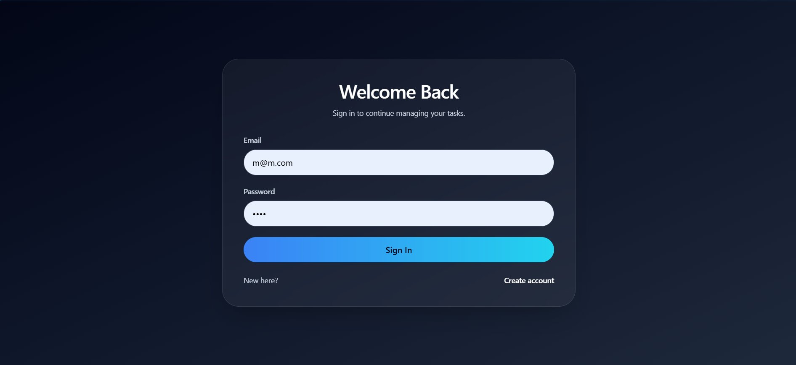
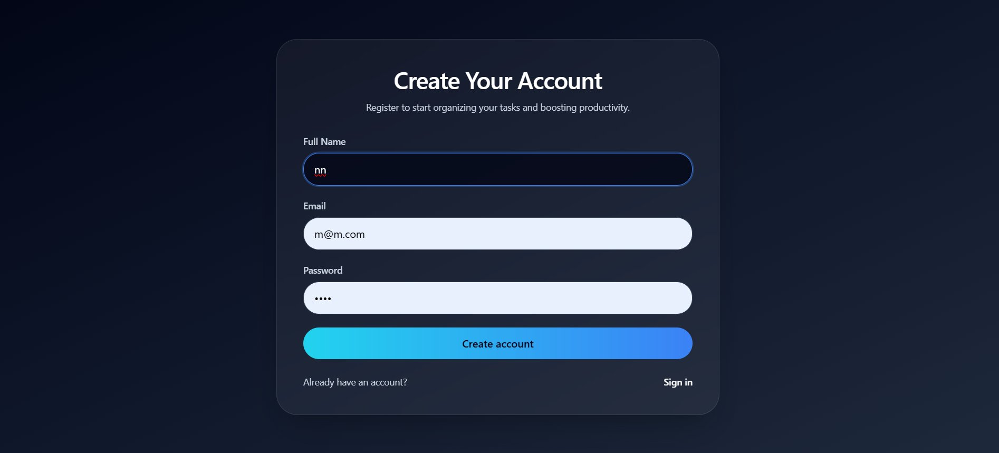
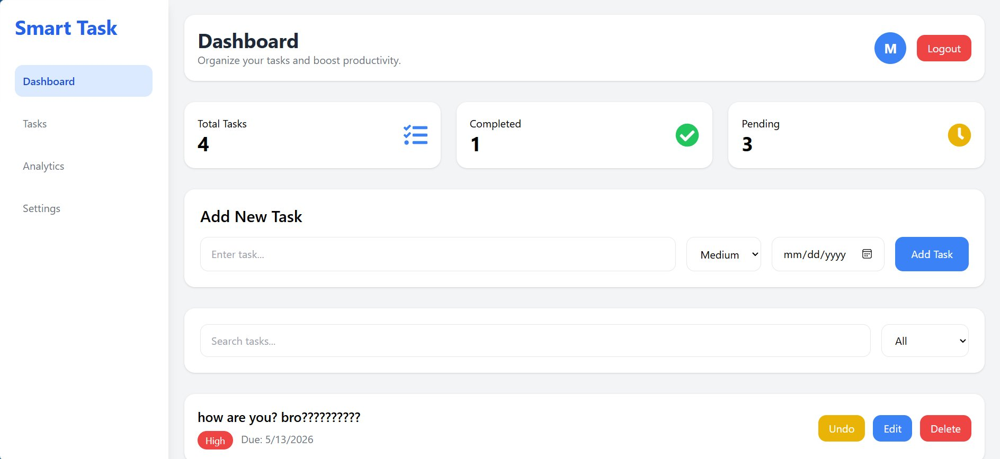
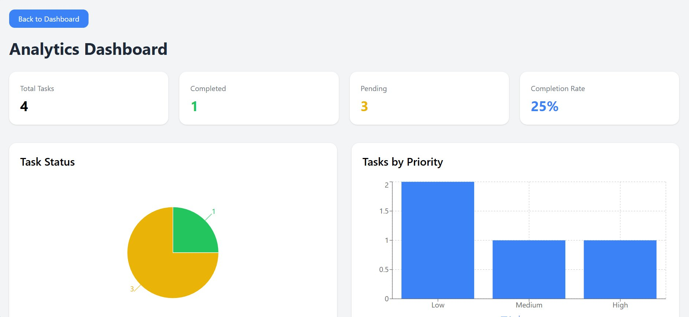

# Smart Task Manager

A full-stack task management web application built with React and Node.js, featuring real-time task tracking, priority management, and analytics — all backed by a MongoDB database.

---

## Live Demo

🌐 **Frontend:** [https://smart-task-manager-navy.vercel.app](https://smart-task-manager-navy.vercel.app)

🔗 **Backend API:** [https://smart-task-manager-5lyy.onrender.com](https://smart-task-manager-5lyy.onrender.com)

---

## Features

- **User Authentication** — Secure register and login with JWT-based sessions
- **Task Management** — Create, edit, delete, and toggle tasks as complete/pending
- **Priority Levels** — Assign Low, Medium, or High priority to each task
- **Due Dates** — Set and track deadlines for every task
- **Search & Filter** — Instantly search tasks and filter by All / Completed / Pending
- **Analytics Dashboard** — Visualize task completion rates with pie and bar charts
- **Responsive UI** — Mobile-friendly layout with a collapsible sidebar
- **Toast Notifications** — Real-time feedback for every user action

---

## Tech Stack

### Frontend
| Technology | Purpose |
|---|---|
| React | UI framework |
| React Router DOM | Client-side routing |
| Axios | HTTP requests |
| Recharts | Data visualization (pie & bar charts) |
| Tailwind CSS | Utility-first styling |
| React Toastify | Toast notifications |
| React Icons | Icon library |

### Backend
| Technology | Purpose |
|---|---|
| Node.js + Express | REST API server |
| MongoDB + Mongoose | Database & ODM |
| bcryptjs | Password hashing |
| JSON Web Tokens (JWT) | Authentication |
| dotenv | Environment variable management |
| CORS | Cross-origin request handling |

---

## Project Structure

```
smart-task-manager/
│
├── public/                        # Static assets
│
├── server/                        # Express API server
│   ├── controllers/               # Route handler logic
│   ├── middleware/                 # Custom middleware (e.g. auth)
│   ├── models/                    # Mongoose schemas
│   │   ├── User.js
│   │   └── Task.js
│   ├── routes/                    # API route definitions
│   │   ├── authRoutes.js
│   │   └── taskRoutes.js
│   ├── .env                       # Backend environment variables
│   └── index.js                   # Server entry point
│
└── src/                           # React application
    ├── components/                # Reusable UI components
    ├── pages/                     # Page-level components
    │   ├── Login.js
    │   ├── Register.js
    │   ├── Dashboard.js
    │   ├── Analytics.js
    │   ├── Tasks.js
    │   ├── Settings.js
    │   └── NotFound.js
    ├── services/                  # API call abstractions
    ├── App.js
    ├── App.css
    ├── index.js
    └── index.css
```

---

## Getting Started

### Prerequisites

- Node.js v18+
- MongoDB (local or [MongoDB Atlas](https://www.mongodb.com/cloud/atlas))
- npm

---

### 1. Clone the Repository

```bash
git clone https://github.com/NafreesMIM/smart-task-manager.git
cd smart-task-manager
```

---

### 2. Backend Setup

```bash
cd server
npm install
```

Create a `.env` file in the `server/` directory:

```env
MONGO_URI=your_mongodb_connection_string
JWT_SECRET=your_jwt_secret_key
PORT=5000
```

Start the backend server:

```bash
node index.js
```

The API will be running at `http://localhost:5000`.

---

### 3. Frontend Setup

```bash
cd ..
npm install
```

Create a `.env.example` file in the root directory (next to `src/`):

```env
REACT_APP_API_URL=http://localhost:5000
```

Start the React development server:

```bash
npm start
```

The app will be running at `http://localhost:3000`.

---

## API Endpoints

### Auth Routes — `/api/auth`

| Method | Endpoint | Description |
|---|---|---|
| POST | `/register` | Register a new user |
| POST | `/login` | Login and receive a JWT token |

### Task Routes — `/api/tasks`

| Method | Endpoint | Description |
|---|---|---|
| GET | `/:userId` | Fetch all tasks for a user |
| POST | `/` | Create a new task |
| PUT | `/edit/:taskId` | Update task title, priority, or due date |
| PUT | `/toggle/:taskId` | Toggle task completion status |
| DELETE | `/:taskId` | Delete a task |

---

## Environment Variables

| Variable | Description |
|---|---|
| `MONGO_URI` | MongoDB connection string |
| `JWT_SECRET` | Secret key for signing JWT tokens |
| `PORT` | Port for the backend server (default: 5000) |
| `REACT_APP_API_URL` | Base URL of the backend API |

---

## Screenshots

### 🔐 Login


### 📝 Register


### 🏠 Dashboard


### 📊 Analytics


---

## Roadmap

- [ ] Profile management
- [ ] Notification preferences
- [ ] Privacy controls
- [ ] Filtering tasks by due date
- [ ] Bulk task actions
- [ ] Dark mode support

---

## License

This project is open source and available under the [MIT License](LICENSE).

---

## Author

- GitHub: [@NafreesMIM](https://github.com/NafreesMIM)
- LinkedIn: [nafrees-mim](https://www.linkedin.com/in/nafrees-mim-475b7728a/)
